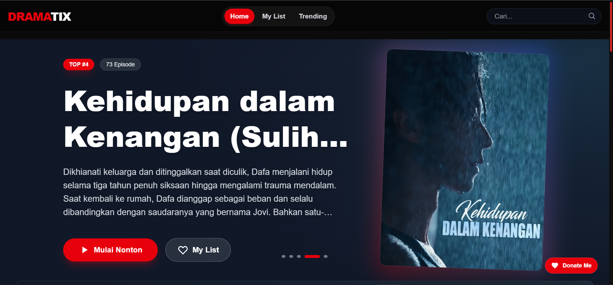
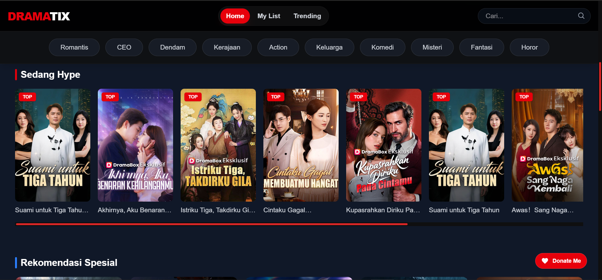
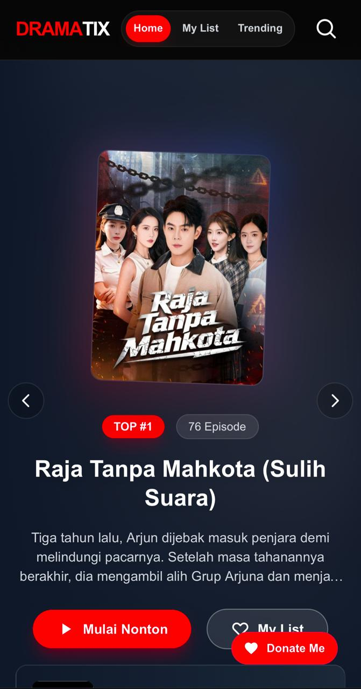
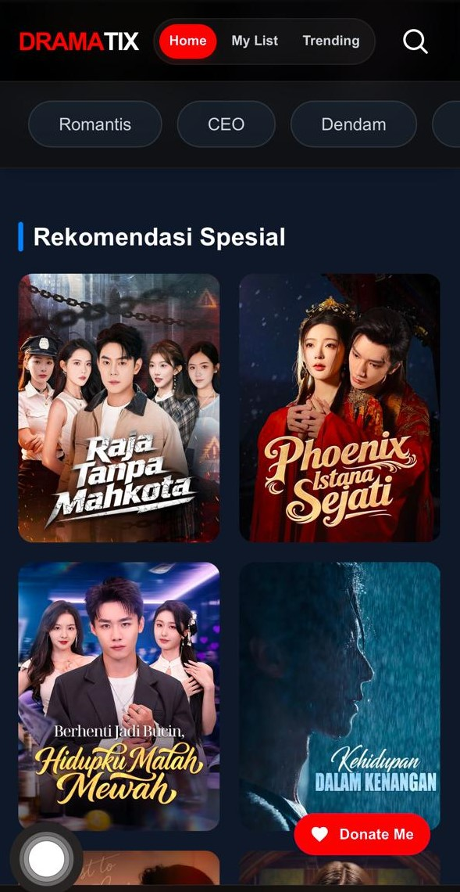

 <h1> DRAMATIX</h1> 
<strong>Next-Generation Cinema Experience Platform</strong>

     

Interface Demo

   
 
   
 

<b>Overview</b>

Dramatix is a modern web application dedicated to drama and movie streaming enthusiasts. The main focus of this project is on access speed, a clean interface, and user comfort in exploring cinematic content. Built with the latest Next.js 15 technology, this project ensures optimal performance and is SEO-friendly.

<b>Key Features</b>

Modern Video Player: An elegant video player interface with intuitive controls.

Seamless Navigation: Move between pages without reloading thanks to Next.js App Router technology.

Responsive Display: Layouts that automatically adjust for mobile, tablet, and desktop devices.

VIP Membership System: Subscription features for VIP packages (Lite, Gold, Silver) for exclusive content access and an ad-free experience.

Dark UI Design (Dark Mode): A premium dark theme designed to reduce eye fatigue during long-duration viewing.

<b>Technologies Used</b>

Framework: Next.js 15 (App Router)

Styling: Tailwind CSS

Environment: Node.js Optimized

Tools: Git & GitHub

<b>Installation & Local Setup</b>

To run this project on your local machine, follow these steps:

Clone Repository: git clone https://github.com/username/dramatix.git

Install Dependencies: npm install

Run Development Server: npm run dev

Build for Production: npm run build

<b>Contribution</b>

I am very open to anyone who wants to contribute. If you find a bug or have an idea for a new feature, please create an issue or submit a pull request in this repository.

 
© 2026 Dramatix - Rezaaplvv
 

